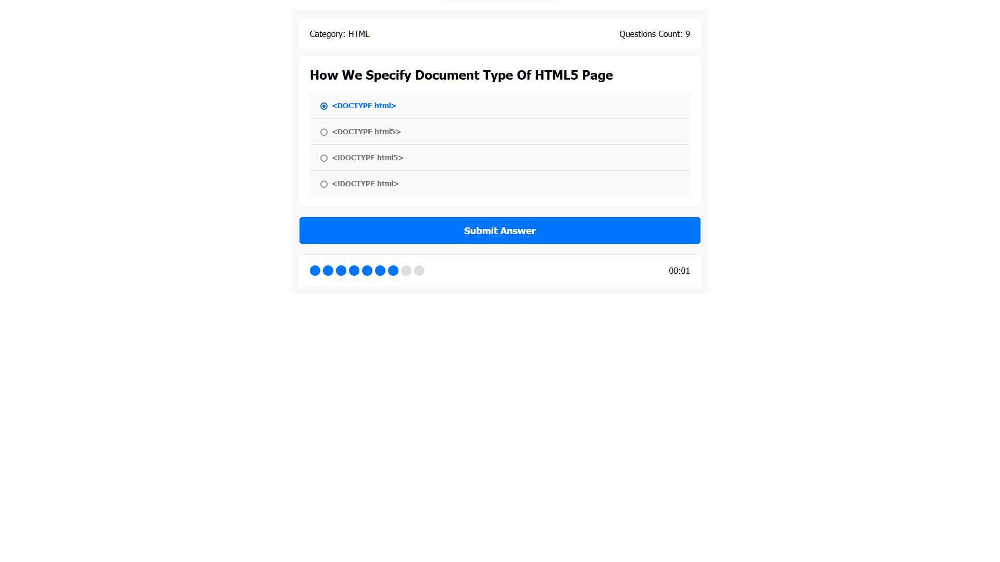

# Quiz App



## Overview

The Questions Quiz App is a web application that allows users to test their knowledge by answering a series of questions on various topics. This app is designed to be fun and educational, providing an enjoyable way to learn new facts and challenge yourself with quizzes.

## Live Demo

You can try the app live by clicking [here](https://yossefelnajjar.github.io/quiz-app/).

## Features

- **Multiple Quiz Categories:** Choose from a wide range of quiz categories to test your knowledge in different areas of interest.

- **Random Quizzes:** Take random quizzes to challenge yourself with questions from various categories.

- **Score Tracking:** Keep track of your quiz scores and compete with friends to see who can achieve the highest score.

## How to Use

1. Visit the [live demo](https://yossefelnajjar.github.io/quiz-app/) of the app.

2. Select a quiz category or choose a random quiz.

3. Answer the questions one by one.

4. Your score will be calculated at the end of the quiz.

5. Share your score with friends and challenge them to beat it!

## Getting Started (For Developers)

If you want to run this app locally or contribute to its development, follow these steps:

1. Clone the repository:

   ```bash
   git clone https://github.com/yourusername/quiz-app.git
   ```

2. Navigate to the project directory:

   ```bash
   cd quiz-app
   ```

3. Open the `index.html` file in your preferred web browser to run the app locally.
